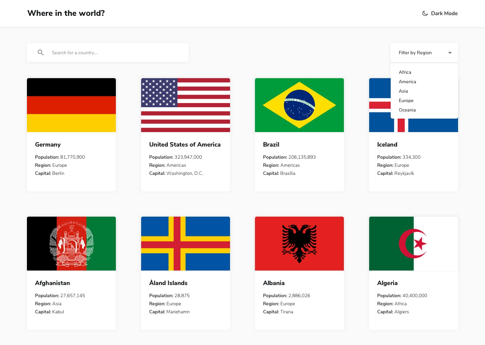

# REST Countries API

#### A full-stack web application built as first project.

## Description
This application is meant to be informative for anyone wanting to learn general information about all the countries currently in the world.

## Table of Contents
* [Technologies Used](#technologiesused)
* [Features](#features)
* [Design](#design)
* [Project Next Steps](#nextsteps)
* [Deployed App](#deployment)
* [About the Author](#author)

## Technologies Used
* JavaScript
* HTML5
* CSS3
* REST Country API

## Features
Users can search directyly for or filter through all of the countries.
Users can switch from light and dark modes for personal preference.

## Whiteboard Images
*can be found in project Images folder

## Trello Planning
* https://trello.com/invite/b/692723a2788e741d7976a113/ATTI07a57d121d2074a7c971d9c121c68eb44D401123/rest-countries

## Design
* Design elements implemented using HTML5 and CSS3. 

## Project Next Steps
* Allow the user to use the search and filter functions simultaneusly
* Add a function where Carmen Sandiego randomly pops up and gives additional info. 

## Deployed Link
[Netlify]((https://6931ac75ac5c7070f1706a75--wonderful-liger-0295b7.netlify.app/))

* You can view the repository:
[Github.com](https://github.com/Shallen-99/rest-countries-api.git)
* If unable to view please go live locally through VS Code

## About The Author
I build applications and mini projects tied to my various interests. I look for creative solutions to real world problems and think of technical ways to address them. While no application is ever perfect I find joy in the process and all my final products!
    
## Works Cited:
*https://stackoverflow.com
*https://www.w3schools.com
